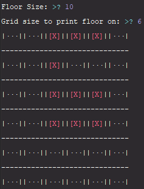

# isek-baby
Binding of Isaac-style dungeon layout generator written in Python  
## Usage
* Create an instance of FloorGenerator
* Call generateFloor every time you want to create a new layout

To print a preview, run isek-baby.py in python console
## Example
 
